## 1 关于本文档的开源协议说明
**您可以自由地：**

**分享** 

- 在任何媒介以任何形式复制、发行本文档

**演绎** 

- 修改、转换或以本文档为基础进行创作。只要你遵守许可协议条款，许可人就无法收回你的这些权利。

**惟须遵守下列条件：**

**署名** 

- 您必须提供适当的证书，提供一个链接到许可证，并指示是否作出更改。您可以以任何合理的方式这样做，但不是以任何方式表明，许可方赞同您或您的使用。

**非商业性使用** 

- 您不得将本作品用于商业目的。

**相同方式共享** 

- 如果您的修改、转换，或以本文档为基础进行创作，仅得依本素材的
授权条款来散布您的贡献作品。

**没有附加限制** 

- 您不能增设法律条款或科技措施，来限制别人依授权条款本已许可的作为。

**声明：**

-  当您使用本素材中属于公众领域的元素，或当法律有例外或限制条款允许您的使用，
则您不需要遵守本授权条款。
未提供保证。本授权条款未必能完全提供您预期用途所需要的所有许可。例如：形象
权、隐私权、著作人格权等其他权利，可能限制您如何使用本素材。

**注意**

- 为了方便用户理解，这是协议的概述. 可以访问网址 https://creativecommons.org/licenses/by-sa/3.0/legalcode 了解完整协议内容.

## 2 前言
### 目的
本文档介绍基于Huawei LiteOS如何移植到第三方开发板，并成功运行基础示例。
### 读者对象
本文档主要适用于Huawei LiteOS Kernel的开发者。
本文档主要适用于以下对象：
- 物联网端软件开发工程师
- 物联网架构设计师

### 符号约定
在本文中可能出现下列标志，它们所代表的含义如下。

     用于警示紧急的危险情形，若不避免，将会导致人员死亡或严重的人身伤害

    用于警示潜在的危险情形，若不避免，可能会导致人员死亡或严重的人身伤害

    用于警示潜在的危险情形，若不避免，可能会导致中度或轻微的人身伤害

     用于传递设备或环境安全警示信息，若不避免，可能会导致设备损坏、数据丢失、设备性能降低或其它不可预知的结果“注意”不涉及人身伤害

| 说明	|		“说明”不是安全警示信息，不涉及人身、设备及环境伤害信息	|

### 修订记录
修改记录累积了每次文档更新的说明。最新版本的文档包含以前所有文档版本的更新
内容。

<table>
	<tr>
	<td>日期</td>
	<td>修订版本</td>
	<td>描述</td>
	</tr>
	<tr>
	<td>2017年06月26日</td>
	<td>1.0</td>
	<td>完成初稿</td>
	</tr>
</table>

## 3 概述

目前在github上已开源的Huawei LiteOS内核源码已适配好STM32F412、STM32F429、STM32L476、GD32F450、GD32F190等M3/M4内核芯片，本手册将以TI的CC3220SF的开发板[LAUNCHXL_CC3220SF](http://www.ti.com.cn/tool/cn/cc3220sf-launchxl)为例，介绍CC3220SF的移植过程   

## 4 环境准备
基于Huawei LiteOS Kernel开发前，我们首先需要准备好单板运行的环境，包括软件环
境和硬件环境。
硬件环境：

<table>
	<tr>
	<td>所需硬件</td>
	<td>描述</td>
	</tr>
	<tr>
	<td>LAUNCHXL_CC3220SF</td>
	<td>CC3220SF开发板</td>
	</tr>
	<tr>
	<td>PC机</td>
	<td>用于编译、加载并调试镜像</td>
	</tr>
	<tr>
	<td>电源（5v）</td>
	<td>开发板供电(使用Mini USB连接线)</td>
	</tr>
</table>

软件环境：

<table>
	<tr>
	<td>软件</td>
	<td>描述</td>
	</tr>
	<tr>
	<td>Window 7 操作系统</td>
	<td>安装KEIL和J-link驱动的操作系统</td>
	</tr>
	<tr>
	<td>KEIL V5.23</td>
	<td>用于编译、链接、调试程序代码
	</td>
	</tr>
</table>

**说明**

KEIL工具需要开发者自行购买，LAUNCHXL_CC3220SF自带板载XDS-110仿真器。

## 5 获取Huawei LiteOS 源码

首先我们需要通过网络下载获取Huawei LiteOS开发包。目前Huawei LiteOS的代码已经
开源，可以直接从网络上获取，步骤如下：

- 仓库地址是https://github.com/LITEOS/LiteOS_Kernel.git 

- 点击”clone or download”按钮,下载源代码

- 目录结构如下：Huawei LiteOS的源代码目录的各子目录包含的内容如下：

关于代码树中各个目录存放的源代码的相关内容简介如下：

<table>
<tr>
	<td>一级目录</td>
	<td>二级目录</td>
	<td>说明</td>
</tr>
<tr>
	<td>doc</td>
	<td></td>
	<td>此目录存放的是LiteOS的使用文档和API说明文档</td>
</tr>
<tr>
	<td>example</td>
	<td>api</td>
	<td>此目录存放的是内核功能测试用的相关用例的代码</td>
</tr>
<tr>
	<td></td>
	<td>include</td>
	<td>aip功能头文件存放目录</td>
</tr>
<tr>
	<td>kernel</td>
	<td>base</td>
	<td>此目录存放的是与平台无关的内核代码，包含核心提供给外部调用的接口的头文件以及内核中进程调度、进程通信、内存管理等等功能的核心代码。用户一般不需要修改此目录下的相关内容。</td>
</tr>
<tr>
	<td></td>
	<td>cmsis</td>
	<td>LiteOS提供的cmsis接口</td>
</tr>
<tr>
	<td></td>
	<td>config</td>
	<td>此目录下是内核资源配置相关的代码，在头文件中配置了LiteOS所提供的各种资源所占用的内存池的总大小以及各种资源的数量，例如task的最大个数、信号量的最大个数等等</td>
</tr>
<tr>
	<td></td>
	<td>cpu</td>
	<td>此目录以及以下目录存放的是与体系架构紧密相关的适配LiteOS的代码。比如目前我们适配了arm/cortex-m4及arm/cortex-m3系列对应的初始化内容。</td>
</tr>
<tr>
	<td></td>
	<td>include</td>
	<td>内核的相关头文件存放目录</td>
</tr>
<tr>
	<td></td>
	<td>link</td>
	<td>与IDE相关的编译链接相关宏定义</td>
</tr>
<tr>
	<td>platform</td>
	<td>GD32F190R-EVAL</td>
	<td>GD190开发板systick以及led、uart、key驱动bsp适配代码</td>
</tr>
<tr>
	<td></td>
	<td>GD32F450i-EVAL</td>
	<td>GD450开发板systick以及led、uart、key驱动bsp适配代码</td>
</tr>
<tr>
	<td></td>
	<td>STM32F412ZG-NUCLEO</td>
	<td>STM32F412开发板systick以及led、uart、key驱动bsp适配代码</td>
</tr>
<tr>
	<td></td>
	<td>STM32F429I_DISCO</td>
	<td>STM32F429开发板systick以及led、uart、key驱动bsp适配代码</td>
</tr>
<tr>
	<td></td>
	<td>STM32L476RG_NUCLEO</td>
	<td>STM32L476开发板systick以及led、uart、key驱动bsp适配代码</td>
</tr>
<tr>
	<td></td>
	<td>LAUNCHXL_CC3220SF</td>
	<td>CC3220SF开发板systick以及led、uart、key驱动bsp适配代码</td>
</tr>
<tr>
	<td></td>
	<td>LOS_EXPAND_XXX</td>
	<td>用于新扩展的开发板systick以及led、uart、key驱动bsp适配代码</td>
</tr>
<tr>
	<td>projects</td>
	<td>STM32F412ZG-NUCLEO-KEIL</td>
	<td>stm32f412开发板的keil工程目录</td>
</tr>
<tr>
	<td></td>
	<td>STM32F429I_DISCO_IAR</td>
	<td>stm32f429开发板的iar工程目录</td>
</tr>
<tr>
	<td></td>
	<td>STM32F429I_DISCO_KEIL</td>
	<td>stm32f429开发板的keil工程目录</td>
</tr>
<tr>
	<td></td>
	<td>STM32L476R-NUCLEO-KEIL</td>
	<td>stm32l476开发板的keil工程目录</td>
</tr>
<tr>
	<td></td>
	<td>GD32F190R-EVAL-KEIL</td>
	<td>gd32f190开发板的keil工程目录</td>
</tr>
<tr>
	<td></td>
	<td>GD32F450i-EVAL-KEIL</td>
	<td>gd32f450开发板的keil工程目录</td>
</tr>
<tr>
	<td></td>
	<td>LAUNCHXL_CC3220SF_KEIL</td>
	<td>CC3220SF开发板的keil工程目录</td>
</tr>
<tr>
	<td>user</td>
	<td></td>
	<td>此目录存放用户测试代码，LiteOS的初始化和使用示例在main.c中</td>
</tr>
</table>

获取Huawei LiteOS源代码之后，我们可以将自己本地已有工程的代码适配到LiteOS内核工程中进行应用开发。

## 6 如何适配LiteOS内核工程开发
本章节将描述如何将LiteOS通过KEIL移植到CC3220SF，并演示串口输出、按键中断及LED点亮功能。

### 获取LAUNCHXL_CC3220SF开发板相关工具和SDK

- 登录TI官网下载[uniFlash](http://software-dl.ti.com/ccs/esd/uniflash/uniflash_sl.4.1.1329.exe)和[SDK](http://www.ti.com/tool/download/SIMPLELINK-CC3220-SDK)并安装。 

### 在KEIL上建立CC3220SF开发环境
- 因为KEIL不支持CC3220SF，所以没有便捷的开发包使用，需要自行搭建开发环境。
- 首先，先建立一个KEIL工程，点击option选项，在Device标签页中选择**ARM -> ARM Cortex M4 -> ARMCM4**   

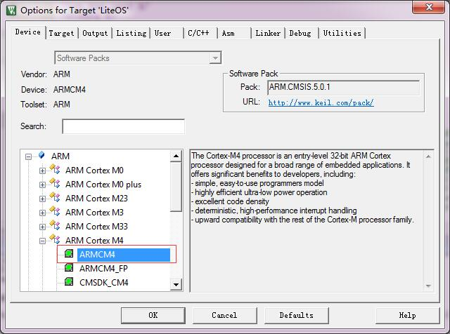  
  
- 根据CC3220SF存储系统的介绍，CC3220SF的内部Flash起始地址为**0x01000000**，而前2k空间留给BootLoader使用，所以0x10000000~0x010007FF是flash头部，需要为BootLoader保留。而留给用户使用的Flash起始地址为**0x01000800**，大小为1022K。RAM起始地址为0x20000000，大小为256K。    

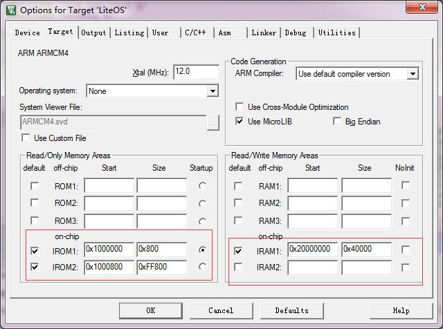     

- Option的Output、Listing、User、Asm标签页中无特别配置，按下图配置即可。  

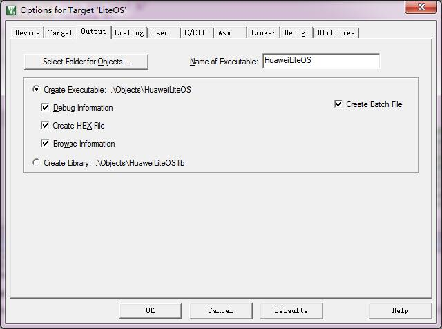    

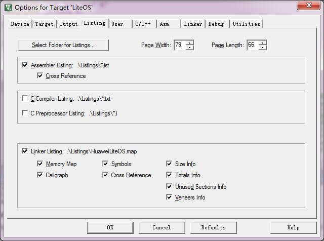    

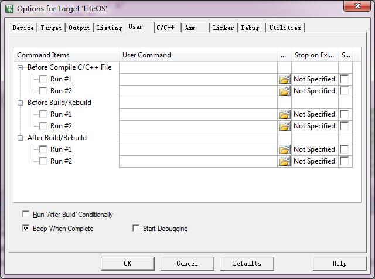     

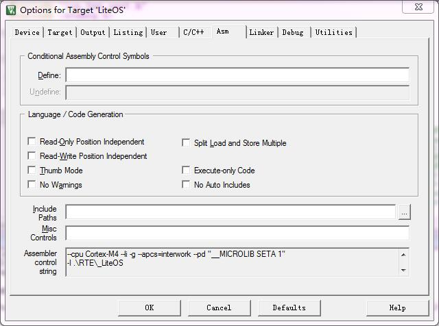   
  
- 在c/c++标签页中定义“LAUNCHXL_CC3220SF”宏定义，添加头文件路径（P.S：CC3220SF没有FPU，所以没有使用内核提供的包含FPU相关操作的M4汇编文件，而使用了M3），如图所示:  

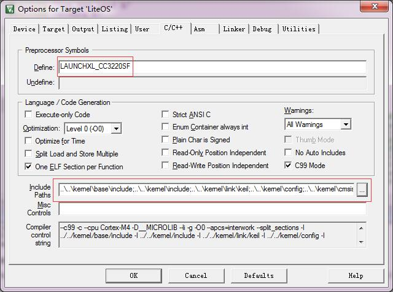    

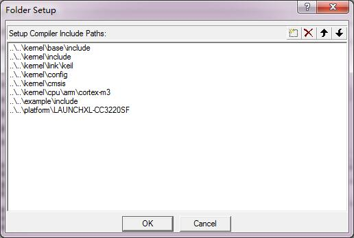   

- 在Linker标签页下，需要选择根据CC3220SF存储系统情况来写的sct文件，如图所示：  
 
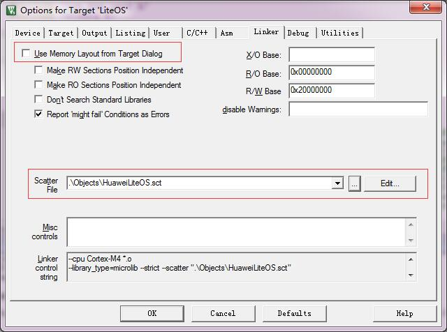    

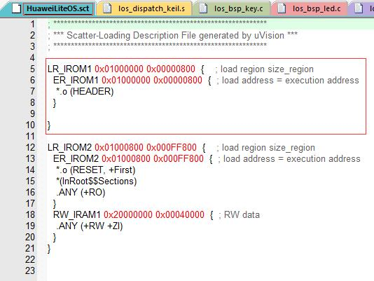    

- 因为当前版本KEIL不支持板载的XDS-110仿真器，所以在Debug标签页下，选择“CMSIS-DAP Debugger”。    

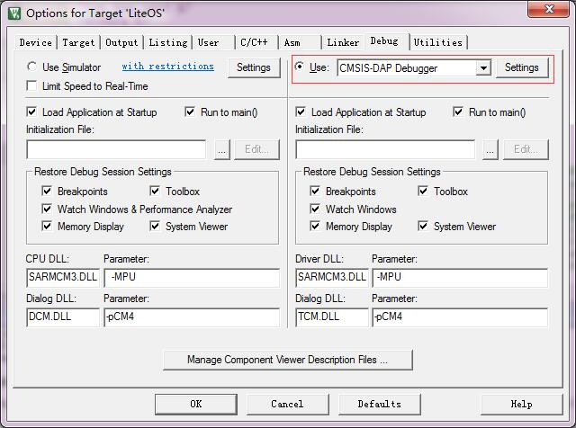    

- 然后将开发板上的SOP设置为001(SWD模式)，即跳线帽在最后面的跳线针上，按下板子上的复位键，再点击Debugger标签页上右面的Setting进一步设置。这时可以选择SWD方式可以发现芯片，证明已经链接成功了。其他选项按图勾选（P.S：目前版本的KEIL在LAUNCHXL_CC3220SF开发板上选择JTAG方式无法发现芯片）    

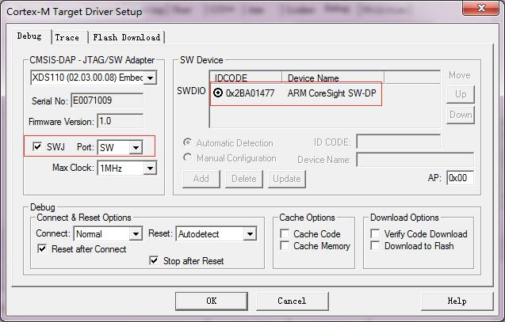    

- 在Setting中的Flash Download标签页中，选择Programming Algorithm。因为目前版本的KEIL不支持CC3220SF芯片，所以需要自己编写烧写算法。烧写算法在**Keil\_v5/ARM/Flash/\_Template**中有模板，结合CC3220SF[技术参考手册](http://www.ti.com.cn/cn/lit/ug/swru465/swru465.pdf)编写合适的烧写算法；也可使用本次移植已经完成的projects/LAUNCHXL\-CC3220SF\_KEIL/**CC3220SF\_For\_LiteOS.FLM**,将该文件复制到**Keil\_v5/ARM/Flash**文件夹下，即可在Flash Download标签页的点击ADD找到对应的算法。  

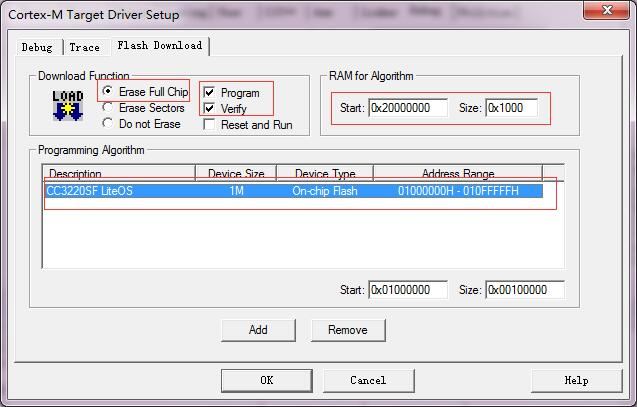    

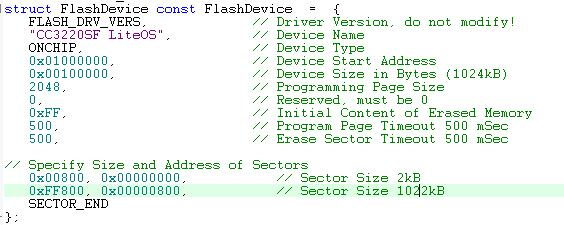    

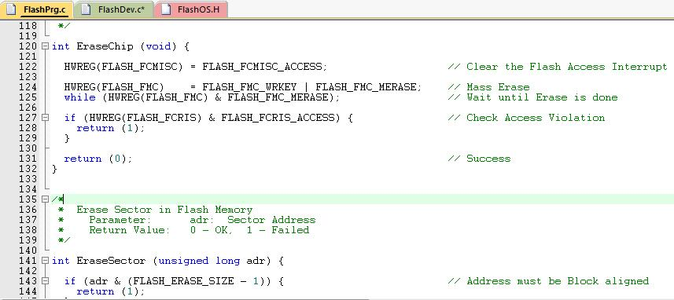    

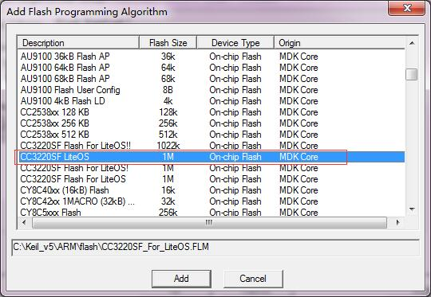    

- 至此，KEIL的CC3220SF的基本开发环境就完成了，对目前版本的KEIL有几点限制需要说明：
  - **不支持LAUNCHXL_CC3220SF板载仿真器XDS110,无法识别仿真器**
  - **不支持CMSIS-DAP Debugger的JTAG，无法识别芯片**
  - **CMSIS-DAP Debugger的SWD模式仿真无法复位芯片**    

### 调试准备
- CC3220SF的启动流程：片内64K ROM的中的BootLoader会比较片外flash和片内flash中的内容，如果不一致将会把片外flash的程序覆盖片内的flash，这样的方式不便于调试，所以选择将片外flash中的程序清空，然后直接在片内flash中进行编程调试。
- 将开发板的SOP设置为010，上电，打开uniflash，点击如图选项：

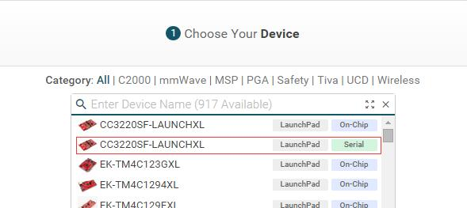    

- 进入后选择Manage Projects，选择导入examples/rtos/CC3220SF\_LAUNCHXL/demos/out\_of\_box/uniflash文件下的固件包。    

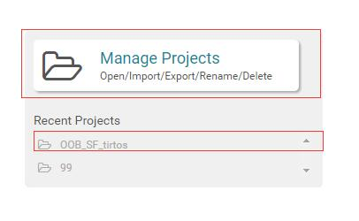     

- 点击User Files，删除所有文件。    

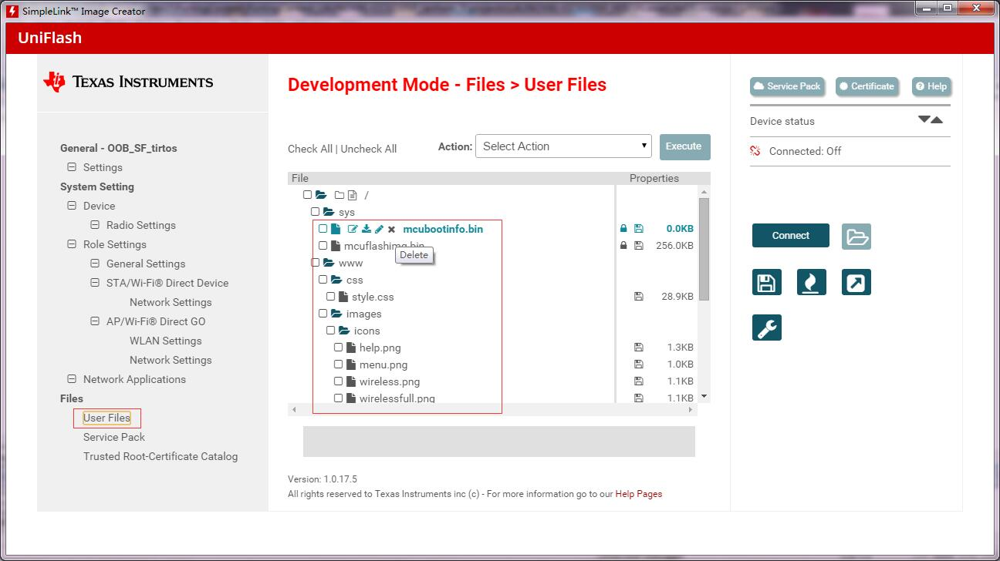   

- 点击右侧“Generate Image”，点击“Connect”，再点击“Programma Image”来清空片外flash。    

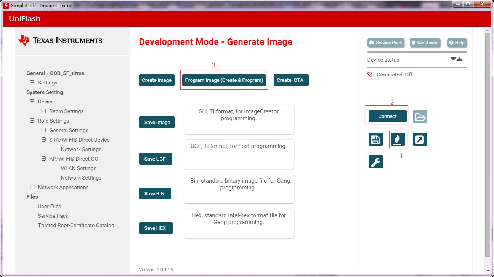  

### 添加LiteOS源码
- 下载LiteOS源码后，根据[KEIL移植指南中添加内核代码](https://github.com/LITEOS/LiteOS_Kernel/blob/master/doc/LiteOS_Migration_Guide_Keil.md)的说明，添加LiteOS**源码**及**包含路径**   

### 选用cpu/M3/下文件
- CC3220SF没有FPU,所以不支持相关的汇编指令，在这里选择复用M3内核下的文件

### 修改config/下文件
- CC3220SF有256k RAM、1024k ROM，主频80MHz，所定义RAM_SIZE_LEVEL_2，OS_SYS_CLOCK为80MHz    

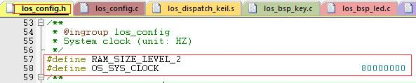 

### 修改los\_bsp\_adapter文件
- 将sys_clk_freq设置为OS_SYS_CLOCK（80MHz），为了能在片内flash上仿真调试CC3220SF，需要在0x01000000起始的位置写入一段特定的数据：    

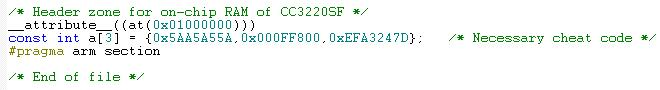    

- 此次移植仅实现KEY,LED,UART的功能，所以需要在代码中实现如下调用：

        void LOS_EvbSetup(void)   
        {   
	        LOS_EvbUartInit();   
	        LOS_EvbLedInit();   
	        LOS_EvbKeyInit();   
	        return ;   
        }   

### 修改los\_bsp\_key文件
- 配置板上的按键SW3（GPIO_22），为方便移植，直接配置寄存器。   

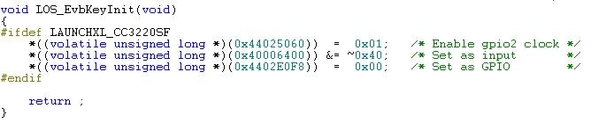

### 修改los\_bsp\_led文件
- 配置板上的LED灯D8-10（GPIO9-11），为方便移植，直接配置寄存器。     
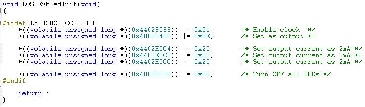

### 修改los\_bsp\_uart文件
- 配置板上的uart0，可直接通过板载的仿真器VCOM打印到PC串口助手上。为方便移植，直接配置寄存器。     
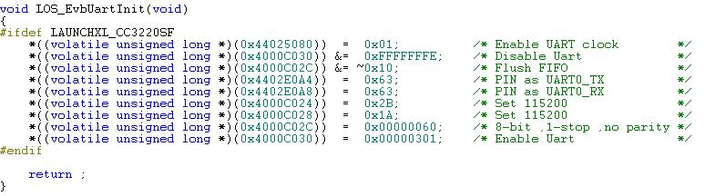

### 修改startup.s文件
- 此处的启动文件可以采用例程中提供的startup.s文件

### 修改main.c文件
- 在main.c中添加修改中断向量表位置，CC3220SF用户flash起始位置为**0x01000800**，调用LOS_Inspect_Entry()巡检程序以检查移植是否正确。

### 移植成功后巡检结果
- 串口打印内容
                
        
                      
        Los Inspect start.
        LOS_TaskLock() Success!
        Example_TaskHi create Success!
        Example_TaskLo create Success!
        Enter TaskHi Handler.
        Enter TaskLo Handler.
        TaskHi LOS_TaskDelay Done.
        TaskHi LOS_TaskSuspend Success.
        TaskHi LOS_TaskResume Success.
        Inspect TASK success
        
        Example_Event wait event 0x1 
        Example_TaskEntry_Event write event .
        Example_Event,read event :0x1
        EventMask:1
        EventMask:0
        Inspect EVENT success
        
        create the queue success!
        recv message:test is message 0
        recv message:test is message 1
        recv message:test is message 2
        recv message:test is message 3
        recv message:test is message 4
        recv message failure,error:200061d
        delete the queue success!
        Inspect MSG success
        
        Example_SemTask2 try get sem g_usSemID wait forever.
        Example_SemTask1 try get sem g_usSemID ,timeout 10 ticks.
        Example_SemTask2 get sem g_usSemID and then delay 20ticks .
        Example_SemTask1 timeout and try get sem g_usSemID wait forever.
        Example_SemTask2 post sem g_usSemID .
        Example_SemTask1 wait_forever and got sem g_usSemID success.
        Inspect SEM success
        
        task2 try to get mutex, wait forever.
        task2 get mutex g_Testmux01 and suspend 100 Tick.
        task1 try to get mutex, wait 10 Tick.
        task1 timeout and try to get  mutex, wait forever.
        task2 resumed and post the g_Testmux01
        task1 wait forever,got mutex g_Testmux01 success.
        Inspect MUTEX success
        
        LOS_CyclePerTickGet = 80000 
        LOS_TickCountGet = 1098 
        LOS_TickCountGet after delay = 1300 
        Inspect SYSTIC success
        
        create Timer1 success
        start Timer1 sucess
        stop Timer1 sucess
        g_timercount1=1
        tick_last1=2609
        delete Timer1 sucess
        start Timer2
        g_timercount2=1
        tick_last2=2713
        g_timercount2=2
        tick_last2=2813
        g_timercount2=3
        tick_last2=2913
        g_timercount2=4
        tick_last2=3013
        g_timercount2=5
        tick_last2=3113
        g_timercount2=6
        tick_last2=3213
        g_timercount2=7
        tick_last2=3313
        g_timercount2=8
        tick_last2=3413
        g_timercount2=9
        tick_last2=3513
        g_timercount2=10
        tick_last2=3613
        Inspect TIMER success
        
        initial......
        node add and tail add......
        add node success
        add tail success
        delete node......
        delete node success
        Inspect LIST success
        
        Mem box init ok!
        Mem box alloc ok
        *p_num = 828
        clear data ok
         *p_num = 0
        Mem box free ok!
        Inspect S_MEM success
        
        mempool init ok!
        mem alloc ok
        *p_num = 828
        mem free ok!
        Inspect D_MEM success
        
        Inspect completed,gInspectErrCnt = [0]
        
        
        Los Key example: please press the UserKey key 
        
        Key test example 
        
        Key test example 

- 按键&LED    

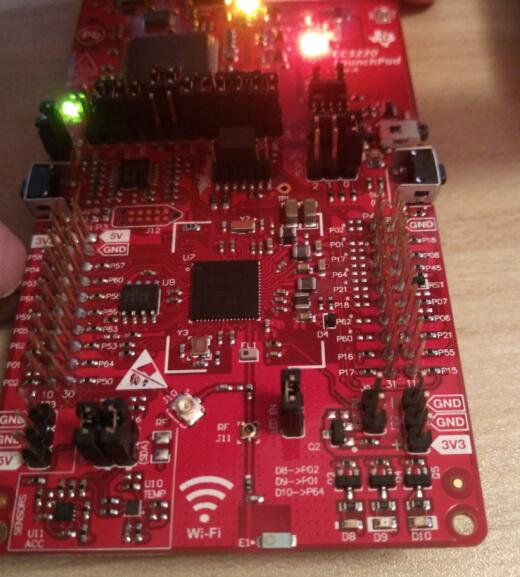    
    
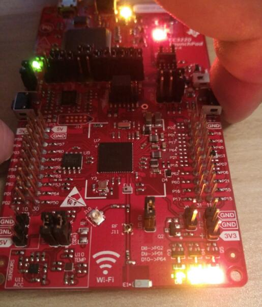  

### 关于仿真说明
- 修改SOP设置后需要重新复位或上电    
- 因为目前的KEIL环境下只能SWD仿真，且无法复位芯片，所以可以在代码启动阶段增加LOOP，在仿真后解除LOOP继续运行，即可从头开始仿真代码。    

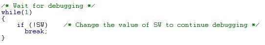 

## 7 其他说明

### 如何使用LiteOS 开发

LiteOS中提供的功能包括如下内容： 任务创建与删除、任务同步（信号量、互斥锁）、动态中断注册机制等等内容，详细内容请参考《HuaweiLiteOSKernelDevGuide》。

### 从零开始创建LiteOS工程

目前在LiteOS的源代码的projects目录下已附带一些开发板的内核示例工程，用户可以直接使用，如果您所使用的开发板（芯片型号）与在示例工程中找不到，您可以从零开始创建LiteOS工程，创建流程请参考《LiteOS_Migration_Guide_Keil》。

### 关于中断向量位置选择

如果您需要使用LiteOS的中断注册机制，详细内容请参考《LiteOS_Migration_Guide_Keil》。

### kernel API测试代码

如果您需要测试LiteOS内核工程运行情况，详细内容请参考《LiteOS_Migration_Guide_Keil》。

