## 1开源协议说明
**您可以自由地：**

**分享** 

- 在任何媒介以任何形式复制、发行本作品

**演绎** 

- 修改、转换或以本作品为基础进行创作。只要你遵守许可协议条款，许可人就无法收回你的这些权利。

**惟须遵守下列条件：**

**署名** 

- 您必须提供适当的证书，提供一个链接到许可证，并指示是否作出更改。您可以以任何合理的方式这样做，但不是以任何方式表明，许可方赞同您或您的使用。

**非商业性使用** 

- 您不得将本作品用于商业目的。

**相同方式共享** 

- 如果您的修改、转换，或以本作品为基础进行创作，仅得依本素材的
授权条款来散布您的贡献作品。

**没有附加限制** 

- 您不能增设法律条款或科技措施，来限制别人依授权条款本已许可的作为。

**声明：**

-  当您使用本素材中属于公众领域的元素，或当法律有例外或限制条款允许您的使用，
则您不需要遵守本授权条款。
未提供保证。本授权条款未必能完全提供您预期用途所需要的所有许可。例如：形象
权、隐私权、著作人格权等其他权利，可能限制您如何使用本素材。

**注意**

- 为了方便用户理解，这是协议的概述. 可以访问网址 https://creativecommons.org/licenses/by-sa/3.0/legalcode 了解完整协议内容.

## 2前言
### 目的
本文档介绍基于Huawei LiteOS如何移植到第三方开发板，并成功运行基础示例。
### 读者对象

本文档主要适用于Huawei LiteOS Kernel的开发者。
本文档主要适用于以下对象：
- 物联网端软件开发工程师
- 物联网架构设计师

### 符号约定
在本文中可能出现下列标志，它们所代表的含义如下。

     用于警示紧急的危险情形，若不避免，将会导致人员死亡或严重的人身伤害

    用于警示潜在的危险情形，若不避免，可能会导致人员死亡或严重的人身伤害

    用于警示潜在的危险情形，若不避免，可能会导致中度或轻微的人身伤害

     用于传递设备或环境安全警示信息，若不避免，可能会导致设备损坏、数据丢失、设备性能降低或其它不可预知的结果“注意”不涉及人身伤害

| 说明	|		“说明”不是安全警示信息，不涉及人身、设备及环境伤害信息	|

### 修订记录
修改记录累积了每次文档更新的说明。最新版本的文档包含以前所有文档版本的更新
内容。

<table>
	<tr>
	<td>日期</td>
	<td>修订版本</td>
	<td>描述</td>
	</tr>
	<tr>
	<td>2017年06月24日</td>
	<td>1.0</td>
	<td>完成初稿</td>
	</tr>
</table>

## 3概述

目前在github上已开源的Huawei LiteOS内核源码已适配好STM32F412、STM32F429、STM32L476、GD32F450、GD32F190、LPC824、LPC54114、MM32F103、MM32L073芯片，本手册将以MM32L073芯片为例，介绍如何将驱动代码移植到内核工程的过程。

## 4环境准备
基于Huawei LiteOS Kernel开发前，我们首先需要准备好单板运行的环境，包括软件环
境和硬件环境。
硬件环境：

<table>
	<tr>
	<td>所需硬件</td>
	<td>描述</td>
	</tr>
	<tr>
	<td>MM32L073 MindBoard</td>
	<td>MM32L073开发板(芯片型号MM32L073PF)</td>
	</tr>
	<tr>
	<td>PC机</td>
	<td>用于编译、加载并调试镜像</td>
	</tr>
	<tr>
	<td>JLink</td>
	<td>用于仿真调试</td>
	</tr>
	<tr>
	<td>电源（5v）</td>
	<td>开发板供电(使用Micro USB连接线)</td>
	</tr>
</table>

软件环境：

<table>
	<tr>
	<td>软件</td>
	<td>描述</td>
	</tr>
	<tr>
	<td>Window 7 操作系统</td>
	<td>安装Keil</td>
	</tr>
	<tr>
	<td>Keil(5.18以上版本)</td>
	<td>用于编译、链接、调试程序代码
	uVision V5.23.0.0 MDK-Lite</td>
	</tr>
    <tr>
	<td>JLink_Windows_V616b.exe</td>
	<td>j-link仿真器与pc连接的驱动程序，用户加载及调试程序代码</td>
	</tr>
	<tr>
	<td>putty串口调试工具</td>
	<td>串口调试工具，根据个人喜好可使用其他的串口工具</td>
	</tr>
</table>

**说明**

Keil工具需要开发者自行购买,MM32L073开发板的调试器是J-LINK，支持SWD调试接口，使用前需要安装J-LIINK驱动。

## 5获取Huawei LiteOS 源码

首先我们从github上下载Huawei LiteOS内核源代码，步骤如下：

- 仓库地址是https://github.com/LITEOS/LiteOS_Kernel.git 

- 点击”clone or download”按钮,下载源代码

- 目录结构如下：Huawei LiteOS的源代码目录的各子目录包含的内容如下：

关于代码树中各个目录存放的源代码的相关内容简介如下：

<table>
<tr>
	<td>一级目录</td>
	<td>二级目录</td>
	<td>说明</td>
</tr>
<tr>
	<td>doc</td>
	<td></td>
	<td>此目录存放的是LiteOS的使用文档和API说明文档</td>
</tr>
<tr>
	<td>example</td>
	<td>api</td>
	<td>此目录存放的是内核功能测试用的相关用例的代码</td>
</tr>
<tr>
	<td></td>
	<td>include</td>
	<td>aip功能头文件存放目录</td>
</tr>
<tr>
	<td>kernel</td>
	<td>base</td>
	<td>此目录存放的是与平台无关的内核代码，包含核心提供给外部调用的接口的头文件以及内核中进程调度、进程通信、内存管理等等功能的核心代码。用户一般不需要修改此目录下的相关内容。</td>
</tr>
<tr>
	<td></td>
	<td>cmsis</td>
	<td>LiteOS提供的cmsis接口</td>
</tr>
<tr>
	<td></td>
	<td>config</td>
	<td>此目录下是内核资源配置相关的代码，在头文件中配置了LiteOS所提供的各种资源所占用的内存池的总大小以及各种资源的数量，例如task的最大个数、信号量的最大个数等等</td>
</tr>
<tr>
	<td></td>
	<td>cpu</td>
	<td>此目录以及以下目录存放的是与体系架构紧密相关的适配LiteOS的代码。比如目前我们适配了arm/cortex-m4及arm/cortex-m3系列对应的初始化内容。</td>
</tr>
<tr>
	<td></td>
	<td>include</td>
	<td>内核的相关头文件存放目录</td>
</tr>
<tr>
	<td></td>
	<td>link</td>
	<td>IDE相关宏定义</td>
</tr>
<tr>
	<td>platform</td>
	<td>GD32F190R-EVAL</td>
	<td>GD190开发板systick及驱动相关代码</td>
</tr>
<tr>
	<td></td>
	<td>GD32F450i-EVAL</td>
	<td>GD450开发板systick及驱动相关代码</td>
</tr>
<tr>
	<td></td>
	<td>STM32F412ZG-NUCLEO</td>
	<td>STM32F412开发板systick及驱动相关代码</td>
</tr>
<tr>
	<td></td>
	<td>STM32F429I_DISCO</td>
	<td>STM32F429开发板systick及驱动相关代码</td>
</tr>
<tr>
	<td></td>
	<td>STM32L476RG_NUCLEO</td>
	<td>STM32L476开发板systick及驱动相关代码</td>
</tr>
<tr>
	<td></td>
	<td>LPC824_LITE</td>
	<td>LPC824Lite开发板systick及驱动相关代码</td>
</tr>
<tr>
	<td></td>
	<td>LPC54110_BOARD</td>
	<td>LPC54110开发板systick及驱动相关代码</td>
</tr>
<tr>
	<td></td>
	<td>MM32F103_MINI</td>
	<td>MM32F103开发板systick及驱动相关代码</td>
</tr>
<tr>
	<td></td>
	<td>MM32L073PF</td>
	<td>MM32L073开发板sysclk及驱动相关代码</td>
</tr>
<tr>
	<td></td>
	<td>LOS_EXPAND_XXX</td>
	<td>用于新扩展的开发板systick以及led、uart、key驱动bsp适配代码</td>
</tr>
<tr>
	<td>projects</td>
	<td>STM32F412ZG-NUCLEO-KEIL</td>
	<td>stm32f412开发板的keil工程目录</td>
</tr>
<tr>
	<td></td>
	<td>STM32F429I_DISCO_IAR</td>
	<td>stm32f429开发板的iar工程目录</td>
</tr>
<tr>
	<td></td>
	<td>STM32F429I_DISCO_KEIL</td>
	<td>stm32f429开发板的keil工程目录</td>
</tr>
<tr>
	<td></td>
	<td>STM32L476R-NUCLEO-KEIL</td>
	<td>stm32l476开发板的keil工程目录</td>
</tr>
<tr>
	<td></td>
	<td>GD32F190R-EVAL-KEIL</td>
	<td>gd32f190开发板的keil工程目录</td>
</tr>
<tr>
	<td></td>
	<td>GD32F450i-EVAL-KEIL</td>
	<td>gd32f450开发板的keil工程目录</td>
</tr>
<tr>
	<td></td>
	<td>LPC824_LITE_KEIL</td>
	<td>lpc824Lite开发板的keil工程目录</td>
</tr>
<tr>
	<td></td>
	<td>LPC54110_BOARD_KEIL</td>
	<td>lpc54110开发板的keil工程目录</td>
</tr>
<tr>
	<td></td>
	<td>MM32F103_MINI_KEIL</td>
	<td>MindMotion MM32F103 MiniBoard开发板的keil工程目录</td>
</tr>
<tr>
	<td></td>
	<td>MM32L073PF_KEIL</td>
	<td>MindMotion MM32L073 MiniBoard开发板的keil工程目录</td>
</tr>
<tr>
	<td>user</td>
	<td></td>
	<td>此目录存放用户代码，LiteOS启动代码在mian()函数中</td>
</tr>
</table>

获取Huawei LiteOS源代码之后，我们可以将自己本地的驱动代码适配到LiteOS内核工程中进行应用开发。

## 6如何适配LiteOS内核工程开发
本章节描述的内容以MM32F103 MiniBoard开发板官方提供的datasheet为基础，控制相关寄存器，添加驱动代码到LiteOS源码MM32L073PF_KEIL工程中，演示按键、LED点亮、串口输出操作。

**MM32L073开发资料获取**

从开发板官网获取开发包资料，网址为：http://www.mindmotion.com.cn/download1.aspx

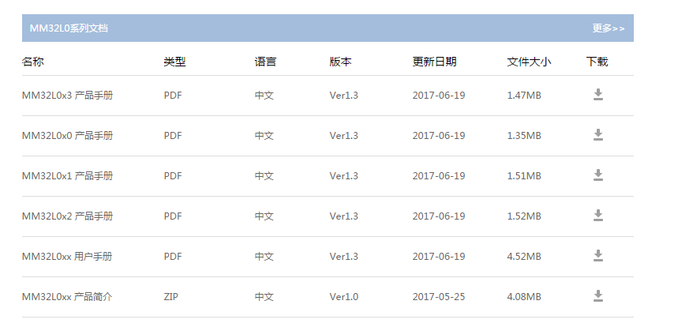

**MM32L073 pack包安装**

解压“MindMotion.MM32L0xx_KEIL.pack_Ver1.0.1.zip”文件，安装MindMotion.MM32L0xx_KEIL.pack_Ver1.0.1.pack文件到keil软件安装目录。

**添加代码到LiteOS工程**

- 我们可以利用LiteOS中已经适配好的MM32F103_MINI，由于都是MindMotion的开发板，相信，我们是可以省下很多事情的，复制platform/MM32F103_MINI一份，重命名为MM32L073PF。

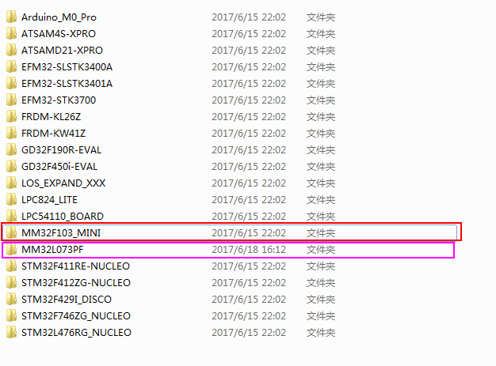

- 开始建立工程，在projects目录下建立MM32L073PF_KEIL。

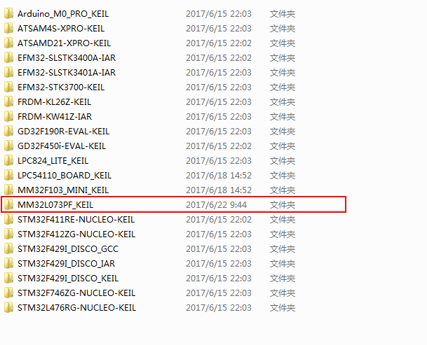

- 打开keil，创建新工程，保存文件名为HuaweiLiteOS，路径为projects/MM32L073PF_KEIL。

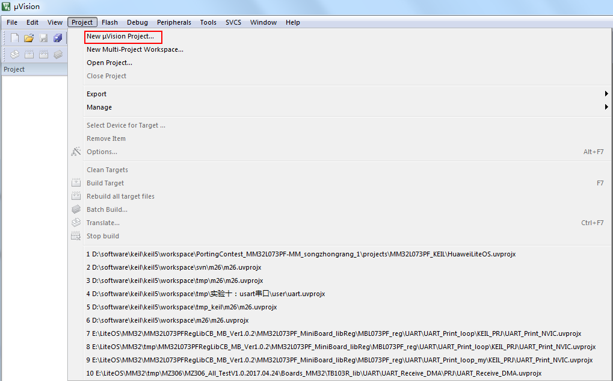

- 点击“保存”后，会提示选择芯片型号，由于我们已经安装了对应的pack包，所以，输入MM32L073，

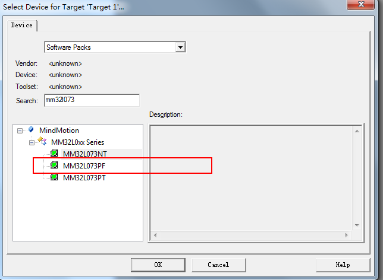

- 这里出现了3个，如何进行选择呢，看下DS_MM32L0x3_Ver1.2.pdf这个文件，也是从MindMotion官网上下载的，看下板子上贴的芯片，便知道了管脚数目是48个，只能是PF了；

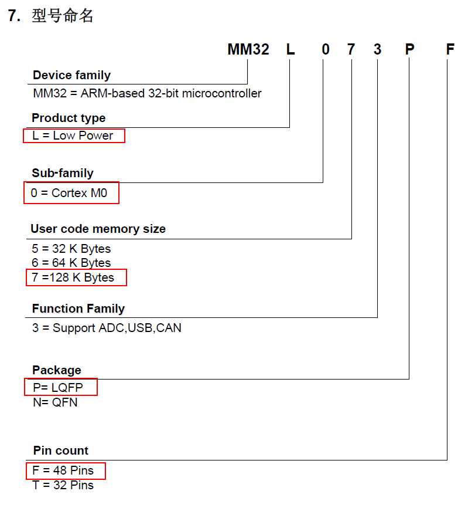

- 芯片型号选择好后，点击OK，弹出一个对话框，忽略，关闭了，之后，弹出如下工程界面

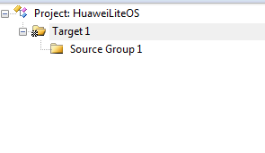

- 修改名称为HuaweiLiteOS，并且依次建立Group，如下；

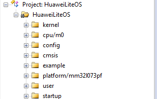

- 考虑到具体驱动的适配，新增一个Group，最终如下的格式：

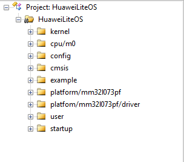

**添加文件到对应的组**

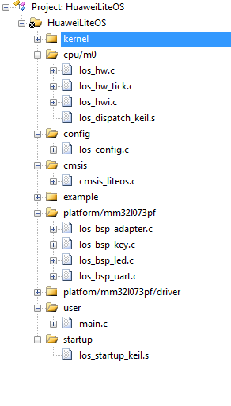

**添加头文件搜索路径、并且配置编译宏**

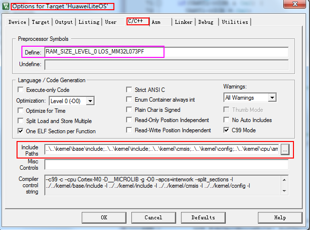

**代码修改适配**

在完成了代码添加及工程配置后，开始修改代码，步骤如下：

- 修改启动文件los_startup_keil.s，在system_MM32L0xx.c中实现配置RCC；

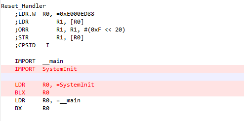

- 配置编译宏，定义RAM_SIZE_LEVEL_0，因为L073PF的RAM只有8K；

- 修改los_bsp_adapter.c文件中的sys_clk_freq变量值与实际配置的系统时钟一致。

	    const unsigned int sys_clk_freq = 48000000;

- 根据datasheet(DS_MM32L0x3_Ver1.2.pdf)和reference manual(UM_MM32L0xx_Ver1.2.pdf)，结合参考例程，配置uart，工程中配置的UART1，正好开发板配套的有个双母头的串口线；可能有的笔记本上没有接口，这里，说下UART2的配置；
这部分，我没有提交，因为UART2和JTAG的管脚接在了一起，调试起来，较为不方便，需要拔掉JTAG，一会，我会把接线图发出来；

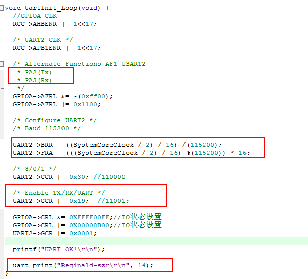

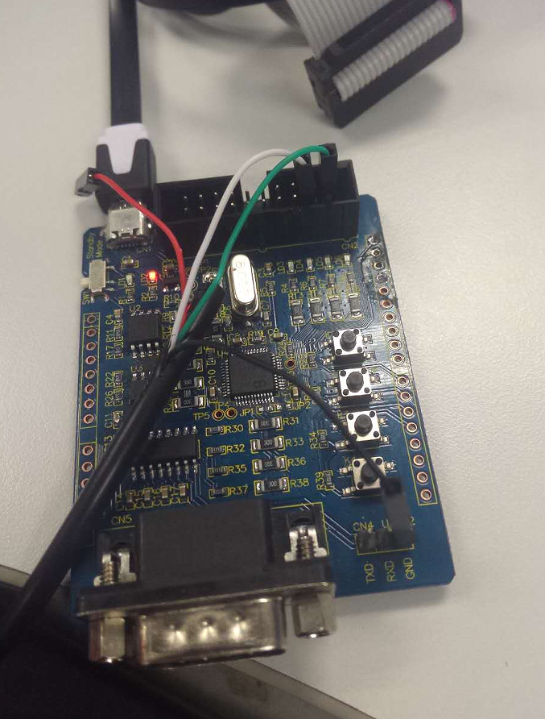

经过以上步骤，完成了代码的初步移植，接下来可以编译代码,连接串口线（事先安装相关驱动）并在串口调试工具中打开相应串口，查看结果

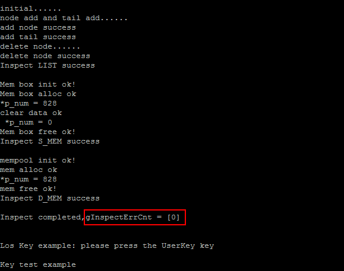

## 7 其他说明

###如何使用LiteOS 开发###

LiteOS中提供的功能包括如下内容： 任务创建与删除、任务同步（信号量、互斥锁）、动态中断注册机制等等内容，详细内容请参考《HuaweiLiteOSKernelDevGuide》。

###从零开始创建LiteOS工程###

目前在LiteOS的源代码的projects目录下已附带一些开发板的内核示例工程，用户可以直接使用，如果您所使用的开发板（芯片型号）与在示例工程中找不到，您可以从零开始创建LiteOS工程，创建流程请参考《LiteOS_Migration_Guide_Keil》。

###关于中断向量位置选择###

如果您需要使用LiteOS的中断注册机制，详细内容请参考《LiteOS_Migration_Guide_Keil》。

### kernel API测试代码 ###

如果您需要测试LiteOS内核工程运行情况，详细内容请参考《LiteOS_Migration_Guide_Keil》。