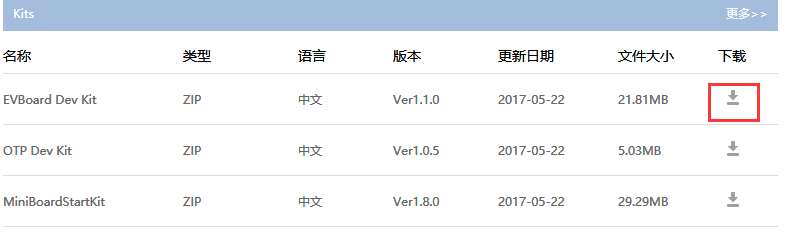
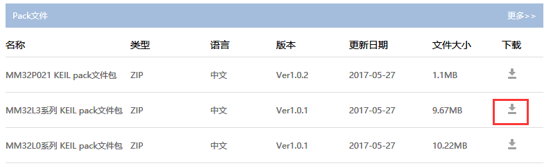
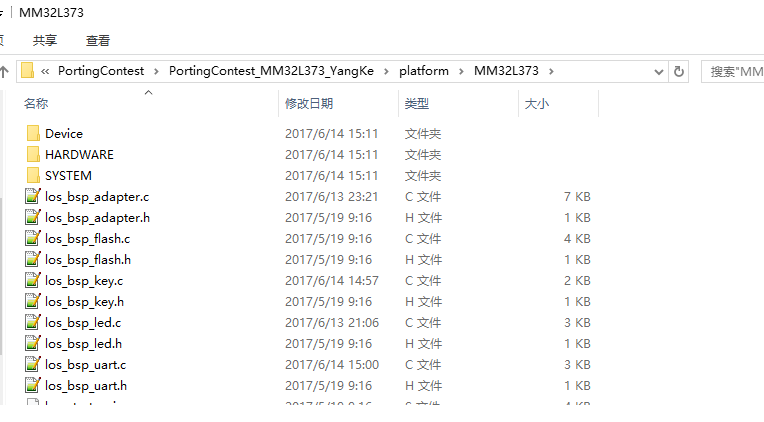
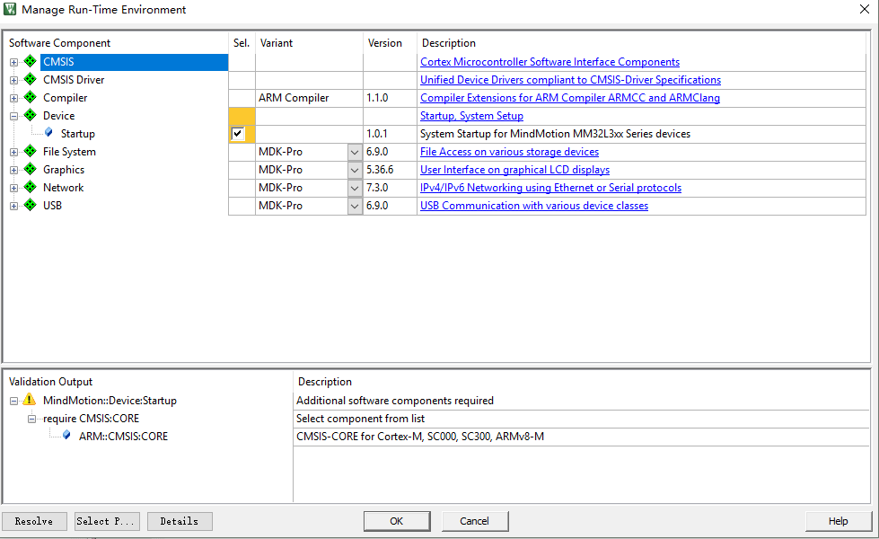
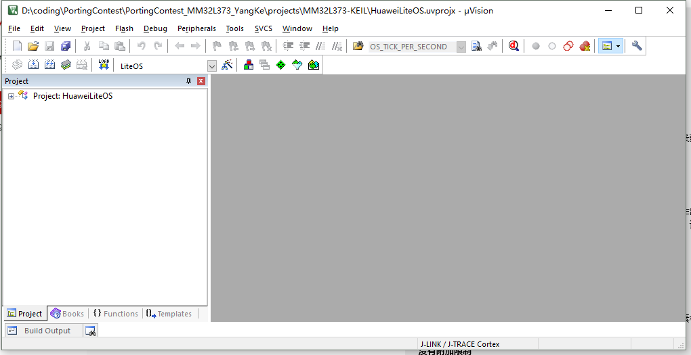
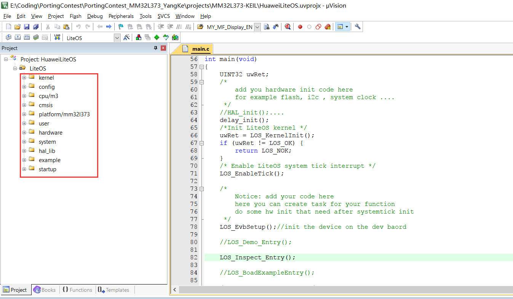
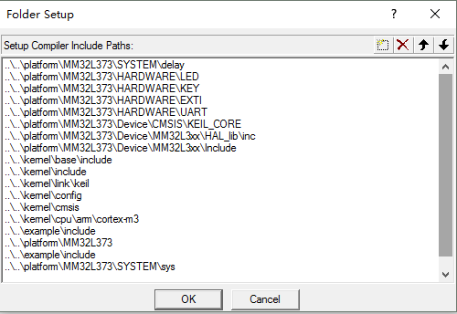
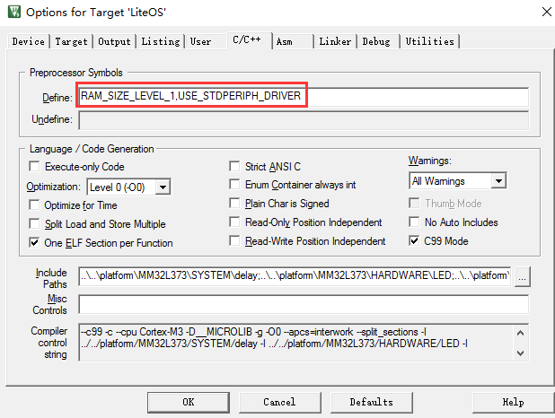
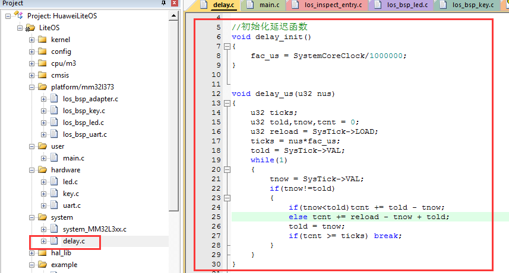

## 1开源协议说明
**您可以自由地：**

**分享** 

- 在任何媒介以任何形式复制、发行本作品

**演绎** 

- 修改、转换或以本作品为基础进行创作。只要你遵守许可协议条款，许可人就无法收回你的这些权利。

**惟须遵守下列条件：**

**署名** 

- 您必须提供适当的证书，提供一个链接到许可证，并指示是否作出更改。您可以以任何合理的方式这样做，但不是以任何方式表明，许可方赞同您或您的使用。

**非商业性使用** 

- 您不得将本作品用于商业目的。

**相同方式共享** 

- 如果您的修改、转换，或以本作品为基础进行创作，仅得依本素材的
授权条款来散布您的贡献作品。

**没有附加限制** 

- 您不能增设法律条款或科技措施，来限制别人依授权条款本已许可的作为。

**声明：**

-  当您使用本素材中属于公众领域的元素，或当法律有例外或限制条款允许您的使用，
则您不需要遵守本授权条款。
未提供保证。本授权条款未必能完全提供您预期用途所需要的所有许可。例如：形象
权、隐私权、著作人格权等其他权利，可能限制您如何使用本素材。

**注意**

- 为了方便用户理解，这是协议的概述. 可以访问网址 https://creativecommons.org/licenses/by-sa/3.0/legalcode 了解完整协议内容.

## 2前言
### 目的
本文档介绍基于Huawei LiteOS如何移植到第三方开发板，并成功运行基础示例。
### 读者对象

本文档主要适用于Huawei LiteOS Kernel的开发者。
本文档主要适用于以下对象：
- 物联网端软件开发工程师
- 物联网架构设计师

### 符号约定
在本文中可能出现下列标志，它们所代表的含义如下。


     用于警示紧急的危险情形，若不避免，将会导致人员死亡或严重的人身伤害

    用于警示潜在的危险情形，若不避免，可能会导致人员死亡或严重的人身伤害

    用于警示潜在的危险情形，若不避免，可能会导致中度或轻微的人身伤害

     用于传递设备或环境安全警示信息，若不避免，可能会导致设备损坏、数据丢失、设备性能降低或其它不可预知的结果“注意”不涉及人身伤害

| 说明	|		“说明”不是安全警示信息，不涉及人身、设备及环境伤害信息	|

### 修订记录
修改记录累积了每次文档更新的说明。最新版本的文档包含以前所有文档版本的更新
内容。

<table>
	<tr>
	<td>日期</td>
	<td>修订版本</td>
	<td>描述</td>
	</tr>
	<tr>
	<td>2017年06月14日</td>
	<td>1.0</td>
	<td>完成初稿</td>
	</tr>
</table>

## 3概述

目前在github上已开源的Huawei LiteOS内核源码已适配好STM32F412、STM32F429、STM32L476、GD32F450、GD32F190、LPC824、LPC54114、MM32F103芯片，本手册将以MM32L373芯片为例，介绍如何将驱动代码移植到内核工程的过程。

## 4环境准备
基于Huawei LiteOS Kernel开发前，我们首先需要准备好单板运行的环境，包括软件环
境和硬件环境。
硬件环境：

<table>
	<tr>
	<td>所需硬件</td>
	<td>描述</td>
	</tr>
	<tr>
	<td>MM32L373_EVB</td>
	<td>MM32L373开发板(芯片型号MM32L373PS)</td>
	</tr>
	<tr>
	<td>PC机</td>
	<td>用于编译、加载并调试镜像</td>
	</tr>
	<tr>
	<td>电源（5v）</td>
	<td>开发板供电(使用Micro USB连接线)</td>
	</tr>
</table>


软件环境：

<table>
	<tr>
	<td>软件</td>
	<td>描述</td>
	</tr>
	<tr>
	<td>Window 10 操作系统</td>
	<td>安装Keil</td>
	</tr>
	<tr>
	<td>Keil(5.18以上版本)</td>
	<td>用于编译、链接、调试程序代码
	uVision V5.18.0.0 MDK-Lite</td>
	</tr>
    <tr>
	<td>Setup_JLinkARM_V490.exe</td>
	<td>j-link仿真器与pc连接的驱动程序，用户加载及调试程序代码</td>
	</tr>
	<tr>
	<td>SerialChart串口调试工具</td>
	<td>串口调试工具，根据个人喜好可使用其他的串口工具</td>
	</tr>
</table>

**说明**

Keil工具需要开发者自行购买,MM32L373开发板的调试器是J-LINK，支持SWD调试接口，使用前需要安装J-LIINK驱动。


## 5获取Huawei LiteOS 源码

首先我们从github上下载Huawei LiteOS内核源代码，步骤如下：

- 仓库地址是https://github.com/LITEOS/LiteOS_Kernel.git 



- 点击”clone or download”按钮,下载源代码

- 目录结构如下：Huawei LiteOS的源代码目录的各子目录包含的内容如下：




关于代码树中各个目录存放的源代码的相关内容简介如下：

<table>
<tr>
	<td>一级目录</td>
	<td>二级目录</td>
	<td>说明</td>
</tr>
<tr>
	<td>doc</td>
	<td></td>
	<td>此目录存放的是LiteOS的使用文档和API说明文档</td>
</tr>
<tr>
	<td>example</td>
	<td>api</td>
	<td>此目录存放的是内核功能测试用的相关用例的代码</td>
</tr>
<tr>
	<td></td>
	<td>include</td>
	<td>aip功能头文件存放目录</td>
</tr>
<tr>
	<td>kernel</td>
	<td>base</td>
	<td>此目录存放的是与平台无关的内核代码，包含核心提供给外部调用的接口的头文件以及内核中进程调度、进程通信、内存管理等等功能的核心代码。用户一般不需要修改此目录下的相关内容。</td>
</tr>
<tr>
	<td></td>
	<td>cmsis</td>
	<td>LiteOS提供的cmsis接口</td>
</tr>
<tr>
	<td></td>
	<td>config</td>
	<td>此目录下是内核资源配置相关的代码，在头文件中配置了LiteOS所提供的各种资源所占用的内存池的总大小以及各种资源的数量，例如task的最大个数、信号量的最大个数等等</td>
</tr>
<tr>
	<td></td>
	<td>cpu</td>
	<td>此目录以及以下目录存放的是与体系架构紧密相关的适配LiteOS的代码。比如目前我们适配了arm/cortex-m4及arm/cortex-m3系列对应的初始化内容。</td>
</tr>
<tr>
	<td></td>
	<td>include</td>
	<td>内核的相关头文件存放目录</td>
</tr>
<tr>
	<td></td>
	<td>link</td>
	<td>IDE相关宏定义</td>
</tr>
<tr>
	<td>platform</td>
	<td>GD32F190R-EVAL</td>
	<td>GD190开发板systick及驱动相关代码</td>
</tr>
<tr>
	<td></td>
	<td>GD32F450i-EVAL</td>
	<td>GD450开发板systick及驱动相关代码</td>
</tr>
<tr>
	<td></td>
	<td>STM32F412ZG-NUCLEO</td>
	<td>STM32F412开发板systick及驱动相关代码</td>
</tr>
<tr>
	<td></td>
	<td>STM32F429I_DISCO</td>
	<td>STM32F429开发板systick及驱动相关代码</td>
</tr>
<tr>
	<td></td>
	<td>STM32L476RG_NUCLEO</td>
	<td>STM32L476开发板systick及驱动相关代码</td>
</tr>
<tr>
	<td></td>
	<td>LPC824_LITE</td>
	<td>LPC824Lite开发板systick及驱动相关代码</td>
</tr>
<tr>
	<td></td>
	<td>LPC54110_BOARD</td>
	<td>LPC54110开发板systick及驱动相关代码</td>
</tr>
<tr>
	<td></td>
	<td>MM32F103_MINI</td>
	<td>MM32F103开发板systick及驱动相关代码</td>
</tr>
<tr>
	<td></td>
	<td>LOS_EXPAND_XXX</td>
	<td>用于新扩展的开发板systick以及led、uart、key驱动bsp适配代码</td>
</tr>
<tr>
	<td>projects</td>
	<td>STM32F412ZG-NUCLEO-KEIL</td>
	<td>stm32f412开发板的keil工程目录</td>
</tr>
<tr>
	<td></td>
	<td>STM32F429I_DISCO_IAR</td>
	<td>stm32f429开发板的iar工程目录</td>
</tr>
<tr>
	<td></td>
	<td>STM32F429I_DISCO_KEIL</td>
	<td>stm32f429开发板的keil工程目录</td>
</tr>
<tr>
	<td></td>
	<td>STM32L476R-NUCLEO-KEIL</td>
	<td>stm32l476开发板的keil工程目录</td>
</tr>
<tr>
	<td></td>
	<td>GD32F190R-EVAL-KEIL</td>
	<td>gd32f190开发板的keil工程目录</td>
</tr>
<tr>
	<td></td>
	<td>GD32F450i-EVAL-KEIL</td>
	<td>gd32f450开发板的keil工程目录</td>
</tr>
<tr>
	<td></td>
	<td>LPC824_LITE_KEIL</td>
	<td>lpc824Lite开发板的keil工程目录</td>
</tr>
<tr>
	<td></td>
	<td>LPC54110_BOARD_KEIL</td>
	<td>lpc54110开发板的keil工程目录</td>
</tr>
<tr>
	<td></td>
	<td>MM32F103_MINI_KEIL</td>
	<td>MindMotion MM32 MiniBoard开发板的keil工程目录</td>
</tr>
<tr>
	<td>user</td>
	<td></td>
	<td>此目录存放用户代码，LiteOS启动代码在mian()函数中</td>
</tr>
</table>

获取Huawei LiteOS源代码之后，我们可以将自己本地的驱动代码适配到LiteOS内核工程中进行应用开发。

## 6获取MM32L373开发板官方资料
本章节描述的内容以MM32L373开发板官方提供的开发包资料为基础，适配硬件LED,KEY,UART驱动代码到LiteOS源码MM32L373_KEIL工程中。

**MM32L373开发资料和MM32L373 pack的获取**

官方获取网址为：http://www.mindmotion.com.cn/download1.aspx






**MM32L373 pack包安装**

解压“MindMotion_MM32L3xx_KEIL.pack_Ver1.0.1.zip”文件，安装MindMotion_MM32L3xx_KEIL.pack_Ver1.0.1.pack文件到keil软件安装目录。

## 7创建Huawei LiteOS 工程

### 7.1 创建工程

获取到LiteOS内核代码后，将您本地的驱动代码库拷贝到platform\LOS_EXPAND_XXX目录下，将LOS_EXPAND_XXX文件夹重命名为MM32L373。




在安装好Keil等开发工具后，我们使用Keil集成开发环境创建Huawei LiteOS工程，步骤如下：

- 打开Keil uVision5， 然后点击project->New uVision Project...创建一个新的工程



- 在projects目录下新建保存工程的文件夹MM32L373-KEIL,保存工程名为HuaweiLiteOS

- 保存后会立即弹出芯片型号选择的窗口，根据实际的开发板的芯片进行选择，我们使用的是mm32l373ps芯片。

- 然后选择要包含的开发基础库，比如CMSIS、DEVICE两个选项可以选择平台提供的支持包和启动汇编文件，目前LiteOS有提供的启动文件是配合中断动态注册功能使用的，我们不需要进行中断动态注册，所以勾选startup。




至此，我们的工程已经创建完成，如下图所示：




完成上面的芯片和支持包选择之后，可以将内核源代码添加到工程中。

### 7.2 添加kernel代码到工程

- 创建LiteOS的相关目录层级



创建完成目录树之后我们添加源代码到目录树中，最终添加完成的内容如下：

- 将kernel/base目录下的所有C文件添加到工程中的kernel下
- 将kernel/cmsis目录下的所有C文件添加到工程中的cmsis下。
- 将platform\MM32L373目录下的所有C文件添加到工程中的platform/mm32l373下
- 将kernel\cpu\arm\cortex-m3目录下的所有C文件以及汇编代码添加到工程中的cpu/m3下
- 将kernel\config目录下的所有C文件添加到工程中的config下
- 将user目录下的所有C文件添加到工程中的user下
- 将\platform\MM32L373\Device\MM32L3xx\HAL_lib\src目录下的芯片函数库C文件添加到工程的hal_lib目录下
- 将\platform\MM32L373\HARDWARE目录下led、key和uart外设C文件添加到工程的hardware目录下
- 将\platform\MM32L373\SYSTEM目录下delay.c文件添加到工程的system目录下
- 将\platform\MM32L373\Device\MM32L3xx\Source目录下的system_MM32L3xx.c文件添加到工程的system目录下
- 添加example/api目录下的所有C文件到工程的example目录下

### 7.3 配置工程属性

- 编译C/C++设置中勾选C99选项



- 配置头文件搜索路径,如下图所示



- 添加编译宏选项，如下图所示




## 8适配驱动代码

- 根据hardware目录下的接口函数led.c、key.c和uart.c，来实现LiteOS中相关的bsp接口函数

（1）los_bsp_adapter.c文件已经配置好系统时钟及SysTick和sysTick_Handler函数，无需修改，确保打开宏定义#define INCLUDE_LOS_HEADER，system目录下delay.c（按键消抖用到delay_us函数）定义如下图：




（2）调用接口函数led.c、key.c和uart.c分别实现los_bsp_led.c、los_bsp_key.c、los_bsp_uart.c等文件中提供的空函数。


（3）为了避免与驱动代码重复定义，修改los_typedef.h中的宏定义，同时修改用到该宏定义的文件。



## 9如何验证移植后的工程

如果您需要验证移植后的LiteOS内核功能，可以参考本章内容。

### 9.1 API测试内核功能

- 目前LiteOS提供了单独测试每个功能的api代码，可在main()函数中调用los_inspect_entry.c文件中的LOS_Inspect_Entry();函数，测试内核所有的功能。

示例代码如下：

int main(void)
{

    UINT32 uwRet;
    /*
        add you hardware init code here
        for example flash, i2c , system clock ....
     */
    //HAL_init();....
     delay_init();
    /*Init LiteOS kernel */
    uwRet = LOS_KernelInit();
    if (uwRet != LOS_OK) {
        return LOS_NOK;
    }
    /* Enable LiteOS system tick interrupt */
    LOS_EnableTick();

    /*
        Notice: add your code here
        here you can create task for your function 
        do some hw init that need after systemtick init
     */
    LOS_EvbSetup();//init the device on the dev baord

    //LOS_Demo_Entry();

    LOS_Inspect_Entry();

    //LOS_BoadExampleEntry();

    /* Kernel start to run */
    LOS_Start();
    for (;;);
    /* Replace the dots (...) with your own code. */
}

- 详细的应用编程API请参考《HuaweiLiteOSKernelDevGuide》。








