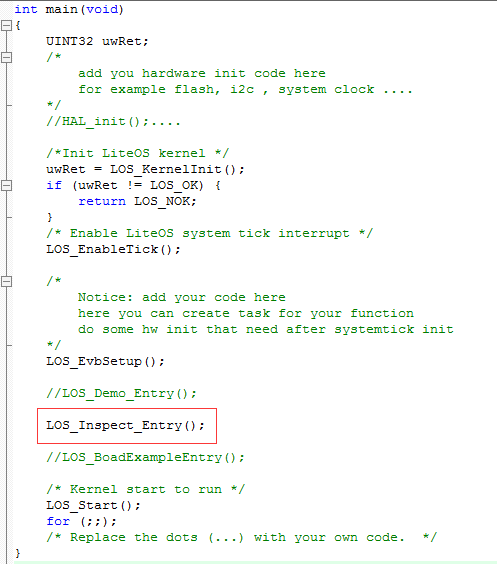
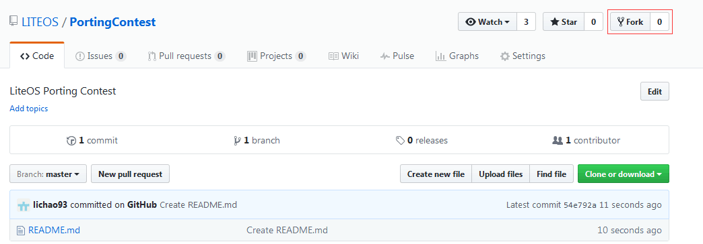
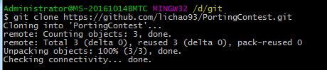
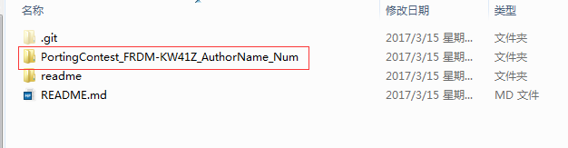
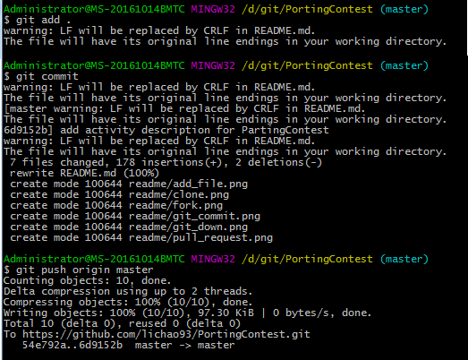
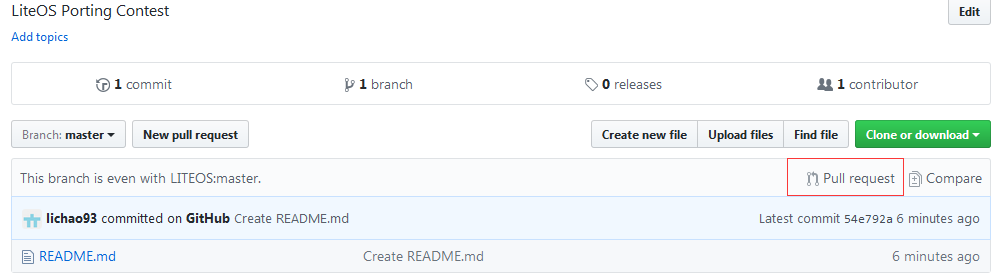

本仓库将作为移植活动的代码及文档提交仓库。

本文作为guideline，指导活动的源码及移植文档下载地址，代码验证及提交的方式。

## 活动主题：寻找移植英雄

活动提供10款开发板（详见论坛帖），开发者自行选择要移植的开发板，将LiteOS成功移植并上传源码和文档到此工程，审核通过即可获得超级大礼！

活动细则请参考论坛帖：http://developer.huawei.com/ict/forum/forum.php?mod=viewthread&tid=536&extra=page%3D1

## 获取LiteOS源码

在github上获取LiteOS最新的代码和文档

- 仓库地址：https://github.com/LITEOS/LiteOS_Kernel.git

- 点击”clone or download”按钮,下载源代码

## 移植说明

### 移植指南文档

源码中的文档都存放在doc目录下，也可在github上直接查看：

https://github.com/LITEOS/LiteOS_Kernel/tree/master/doc

- IAR工程：参考doc目录下的《<a href="https://github.com/LITEOS/LiteOS_Kernel/blob/master/doc/LiteOS_Migration_Guide_IAR.md">LiteOS_Migration_Guide_IAR.md</a>》文档

- Keil工程：参考doc目录下的《<a href="https://github.com/LITEOS/LiteOS_Kernel/blob/master/doc/LiteOS_Migration_Guide_keil.md">LiteOS_Migration_Guide_Keil.md</a>》文档

- 驱动代码适配：参考doc目录下任意已适配的开发板移植指南文档即可

参赛者需要适配Key、Led、Uart等基本驱动代码到移植的工程。

参赛者编写开发板移植指南文档时可参考以上文档，移植文档需要体现出具体的移植过程，可增加必要的相关说明。

### 命名规则

例如移植的开发板名字为FRDM-KW41Z

- project目录下新建工程文件夹,命名为FRDM-KW41Z-KEIL或FRDM-KW41Z-IAR

- 将platform目录下的LOS_EXPAND_XXX文件夹重命名为FRDM-KW41Z

- 驱动相关的Library文件添加到platform/FRDM-KW41Z文件夹下

- 提交的作品命名为PortingContest_FRDM-KW41Z_AuthorName_Num（作者重名时添加序号）

### 结果验证

LiteOS提供了综合功能测试代码，移植后可以通过调用los_inspect_entry.c文件中的LOS_Inspect_Entry()函数进行功能巡检。

若巡检成功，则打印结果如下：
	
	Los Inspect start.
	LOS_TaskLock() Success!
	Example_TaskHi create Success!
	Example_TaskLo create Success!
	Enter TaskHi Handler.
	Enter TaskLo Handler.
	TaskHi LOS_TaskDelay Done.
	TaskHi LOS_TaskSuspend Success.
	TaskHi LOS_TaskResume Success.
	TaskHi LOS_TaskDelete Success.
	Inspect TASK success
	
	Example_Event wait event 0x1 
	Example_TaskEntry_Event write event .
	Example_Event,read event :0x1
	EventMask:1
	EventMask:0
	Inspect EVENT success
	
	create the queue success!
	recv message:test is message 0
	recv message:test is message 1
	recv message:test is message 2
	recv message:test is message 3
	recv message:test is message 4
	recv message failure,error:200061d
	delete the queue success!
	Inspect MSG success
	
	Example_SemTask2 try get sem g_usSemID wait forever.
	Example_SemTask1 try get sem g_usSemID ,timeout 10 ticks.
	Example_SemTask2 get sem g_usSemID and then delay 20ticks .
	Example_SemTask1 timeout and try get sem g_usSemID wait forever.
	Example_SemTask2 post sem g_usSemID .
	Example_SemTask1 wait_forever and got sem g_usSemID success.
	Inspect SEM success
	
	task2 try to get mutex, wait forever.
	task2 get mutex g_Testmux01 and suspend 100 Tick.
	task1 try to get mutex, wait 10 Tick.
	task1 timeout and try to get  mutex, wait forever.
	task2 resumed and post the g_Testmux01
	task1 wait forever,got mutex g_Testmux01 success.
	Inspect MUTEX success
	
	LOS_CyclePerTickGet = 16000 
	LOS_TickCountGet = 1043 
	LOS_TickCountGet after delay = 1244 
	Inspect SYSTIC success
	
	create Timer1 success
	start Timer1 sucess
	stop Timer1 sucess
	g_timercount1=1
	tick_last1=2544
	delete Timer1 sucess
	start Timer2
	g_timercount2=1
	tick_last2=2644
	g_timercount2=2
	tick_last2=2744
	g_timercount2=3
	tick_last2=2844
	g_timercount2=4
	tick_last2=2944
	g_timercount2=5
	tick_last2=3044
	g_timercount2=6
	tick_last2=3144
	g_timercount2=7
	tick_last2=3244
	g_timercount2=8
	tick_last2=3344
	g_timercount2=9
	tick_last2=3444
	g_timercount2=10
	tick_last2=3544
	Inspect TIMER success
	
	initial......
	node add and tail add......
	add node success
	add tail success
	delete node......
	delete node success
	Inspect LIST success
	
	Mem box init ok!
	Mem box alloc ok
	*p_num = 828
	clear data ok
	 *p_num = 0
	Mem box free ok!
	Inspect S_MEM success
	
	mempool init ok!
	mem alloc ok
	*p_num = 828
	mem free ok!
	Inspect D_MEM success
	
	Inspect completed,gInspectErrCnt = [0]
	
	Inspect Key : please press the UserKey key 

    Inspect Key success

- gInspectErrCnt值为0，代表内核部分功能巡检成功。

- 按下自定义的UserKey，开发板上的LED灯被点亮，串口工具上打印出“Inspect Key success”，代表Key、Led、Uart等驱动代码适配成功。

## 活动代码提交

仓库网址：https://github.com/LITEOS/PortingContest

- 点击“Fork”，复刻出自己的PortingContest仓库

- 通过git工具，将参赛代码上传到自己fork出来的PortingContest仓库

（1）首先在git工具上使用"git clone"命令克隆自己fork的仓库

 

（2）将需要提交的作品拷贝到克隆下来的PortingContest文件夹中,图片中内容仅作参考
 
  
 
（3）使用"git add ."、"git commit"、"git push"等命令，将新增的代码及文件上传到自己fork的远程仓库中,图片中内容仅作参考。
 
  

- 提交Pull request到LiteOS的PortingContest master分支

## 其他说明

如您对活动有任何疑问，欢迎在论坛发帖提问或在活动帖中留言

http://developer.huawei.com/ict/forum/forum.php?mod=forumdisplay&fid=156
